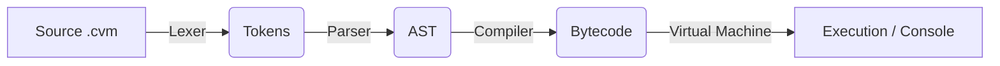

# CVM++ (Custom Virtual Machine & Compiler)


A custom, dynamically-typed scripting language, bytecode compiler, and stack-based virtual machine built from scratch in C++17 to demystify how code executes under the hood.

## 📖 Table of Contents
- [About the Project](#about-the-project)
- [Real-World Applications](#real-world-applications)
- [Architecture Flow](#architecture-flow)
- [Repository Structure](#repository-structure)
- [Getting Started (Build & Run)](#getting-started-build--run)
- [Writing Your Own Code](#writing-your-own-code)
- [Debugging Tools](#debugging-tools)
- [Performance & Benchmarks](#performance--benchmarks)
- [Limitations](#limitations)
- [Documentation Links](#documentation-links)

## <a id="about-the-project"></a>💡 About the Project
Most developers use high-level languages like Python or JavaScript without deeply understanding how raw text translates into instructions a computer can actually execute. CVM++ bridges that gap. It features a custom grammar, a recursive-descent parser, a proprietary 16-bit bytecode compiler, and a blazing-fast stack-based VM.

## <a id="real-world-applications"></a>🌍 Real-World Applications
While CVM++ is an incredible educational tool, its architecture mirrors real-world engines:
1. **Embedded Scripting:** Just as Lua is embedded into C++ game engines, CVM++ can be linked into larger C++ software to allow runtime scripting without recompiling the host app.
2. **Compiler Education:** Serves as a perfect, highly-readable reference implementation for computer science students learning AST generation and Bytecode VM design.
3. **Rapid Prototyping:** The lightweight syntax allows for quick algorithm testing (like sorting or mathematical modeling) without the boilerplate of heavy compiled languages.

## <a id="architecture-flow"></a>🏗️ Architecture Flow



## <a id="repository-structure"></a>🗂️ Repository Structure
* **`src/`** — *C++ Source Code*
  * `lexer.cpp` / `token.hpp` — Lexical analysis and token generation.
  * `parser.cpp` / `ast.hpp` — Recursive descent parsing and AST node structures.
  * `compiler.cpp` / `chunk.cpp` — 16-bit bytecode emission and constant pooling.
  * `vm.cpp` / `value.hpp` — Stack-based execution loop and dynamic type variant handling.
  * `main.cpp` — CLI entry point and pipeline orchestrator.
* **`docs/`** — *Documentation*
  * [`LANGUAGE_REFERENCE.md`](docs/LANGUAGE_REFERENCE.md) — CVM++ syntax guide.
  * [`ISA_REFERENCE.md`](docs/ISA_REFERENCE.md) — Bytecode architecture guide.
* **`tests/`** — *Regression Test Suite*
  * `.cvm` scripts validating scoping, algorithms (Merge Sort, Binary Search), and data structures.

## <a id="getting-started-build--run"></a>🚀 Getting Started (Build & Run)

**Prerequisites:** A C++17 compatible compiler (e.g., `g++`, `clang++`, or MSVC).

**1. Clone & Compile the Engine:**
```bash
git clone https://github.com/yourusername/custom-vm-compiler.git
cd custom-vm-compiler
g++ -std=c++17 src/*.cpp -o cvm.exe
```

**2. Run an Existing Test Script:**
```bash
./cvm.exe test_suite/5_merge_sort.cvm
```

## <a id="writing-your-own-code"></a>✍️ Writing Your Own Code

1. Create a new file with the `.cvm` extension (e.g., `my_app.cvm`).
2. Write your CVM++ script:
```cvm
// my_app.cvm
show("What is your favorite number?\n");
assume num := to_int(ask());
show("Double that is: ");
show(num * 2);
show("\n");
```
3. Save the file and run it through the VM:
```bash
./cvm.exe my_app.cvm
```

## <a id="debugging-tools"></a>🐛 Debugging Tools
CVM++ comes with powerful CLI flags to inspect the internal compiler pipeline:

* **Dump the Abstract Syntax Tree (AST):** Outputs a recursive Unicode tree.
  ```bash
  ./cvm.exe my_app.cvm --dump-ast
  ```
* **Dump the Compiled Bytecode:** Outputs raw memory offsets and 16-bit OpCodes.
  ```bash
  ./cvm.exe my_app.cvm --dump-bytecode
  ```

## <a id="performance--benchmarks"></a>⚡ Performance & Benchmarks
While an interpreted language will not match native C/C++ speed, CVM++ is heavily optimized:
* **Single-Pass Compilation:** AST nodes are flattened instantly into linear contiguous memory (`std::vector<uint8_t>`), maximizing CPU cache hits during execution.
* **Switch-Dispatch Loop:** The VM utilizes an ultra-fast `while(true)` and `switch` statement for instruction decoding, mimicking the core loops of the JVM and CPython.
* **Zero GC Pauses:** By leveraging modern C++ `std::shared_ptr` and `std::variant`, objects are deterministically destroyed the moment they fall out of scope. There is no background Garbage Collector causing runtime latency spikes.

## <a id="limitations"></a>⚠️ Limitations
* **No Error Recovery (Try/Catch):** CVM++ delegates critical errors (like out-of-bounds array access or division by zero) to the C++ backend, which will throw a `std::runtime_error` and terminate the process.
* **No Cyclic Garbage Collection:** Memory relies on reference counting. Creating an array that contains a reference to itself will cause a memory leak.
* **No File I/O Library:** Currently, I/O is restricted to standard console streams (`show` and `ask`).

## <a id="documentation-links"></a>📚 Documentation Links
* [**Language Syntax Reference**](docs/LANGUAGE_REFERENCE.md) — Learn how to code in CVM++.
* [**ISA & Bytecode Reference**](docs/ISA_REFERENCE.md) — Learn how the Virtual Machine processes memory.
