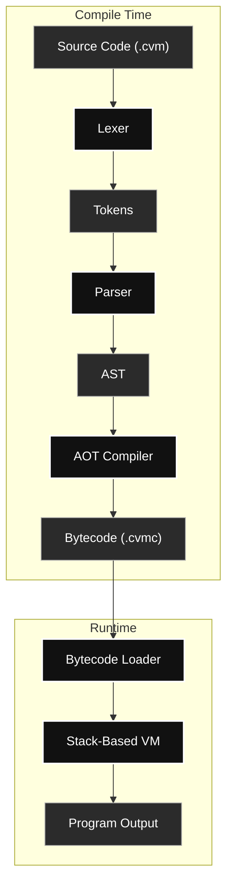

# CVM++ — Custom Bytecode Compiler & Stack-Based Virtual Machine


A custom Ahead-of-Time (AOT) bytecode compiler and stack-based virtual machine built from scratch in C++, designed to demonstrate the complete compilation pipeline from lexical analysis and parsing to bytecode generation and execution.

---

## 📖 Table of Contents   
- [About the Project](#about-the-project)
- [Real-World Applications](#real-world-applications)
- [Architecture Flow](#architecture-flow)
- [Repository Structure](#repository-structure)
- [Getting Started (Build & Run)](#getting-started-build--run)
- [Writing Your Own Code](#writing-your-own-code)
- [Debugging Tools](#debugging-tools)
- [Compiler Verification](#compiler-verification)
- [Limitations](#limitations)
- [Documentation Links](#documentation-links)

---

## <a id="about-the-project"></a>💡 About the Project
Most developers use high-level languages without seeing how source code becomes executable instructions. CVM++ bridges that gap by implementing a complete compiler pipeline in C++, including lexical analysis, recursive-descent parsing, AST construction, bytecode generation, and execution on a custom stack-based virtual machine.

---

## <a id="real-world-applications"></a>🌍 Real-World Applications

While CVM++ is an incredible educational tool, its architecture mirrors real-world AOT compilers:

1. **Compiler Education:** Demonstrates the complete compilation pipeline from lexical analysis and parsing to bytecode generation and execution.
2. **Virtual Machine Design:** Showcases stack-based execution, function calls, control flow, runtime type handling, and bytecode interpretation.
3. **Ahead-of-Time Compilation:** Compiles source code into portable bytecode files that can be executed later without recompiling the original source.

---

## <a id="architecture-flow"></a>🏗️ Architecture Flow



---

## <a id="repository-structure"></a>🗂️ Repository Structure
* **`src/`** — *C++ Source Code*
  * `lexer.cpp` / `lexer.hpp` / `token.hpp` — Lexical analysis and token generation.
  * `parser.cpp` / `parser.hpp` / `ast.hpp` — Recursive descent parsing and AST node structures.
  * `compiler.cpp` / `compiler.hpp` / `chunk.cpp` / `chunk.hpp` — AOT code generation, instruction emission, and constant pooling.
  * `vm.cpp` / `vm.hpp` / `value.hpp` — Runtime execution environment and dynamic type variant handling.
  * `main.cpp` — CLI entry point and pipeline orchestrator.
* **`docs/`** — *Documentation*
  * [`LANGUAGE_REFERENCE.md`](docs/LANGUAGE_REFERENCE.md) — CVM++ syntax guide.
  * [`ISA_REFERENCE.md`](docs/ISA_REFERENCE.md) — Bytecode architecture guide.
* **`test_suite/`** — *Algorithm & Feature Test Suite*
  * Contains scripts validating algorithms (Merge Sort, Binary Search, Fibonacci), logic, and data structures.
* **`tests/`** — *Pipeline Verification Tests*
  * Contains stress tests specifically targeting the Lexer, Parser, Compiler, and VM execution.

---

## <a id="getting-started-build--run"></a>🚀 Getting Started (Build & Run)

**Prerequisites:** A C++17 compatible compiler (e.g., `g++`, `clang++`, or MSVC).

**1. Clone & Compile the Engine:**
```bash
git clone https://github.com/ashutosh-kumar01/custom-vm-compiler.git
cd custom-vm-compiler
g++ -std=c++17 src/*.cpp -o cvm.exe
```

**2 Compile and Run a Program:**
```bash
# Compile source code to bytecode
./cvm.exe compile test_suite/file_name.cvm

# Execute the generated bytecode
./cvm.exe run test_suite/file_name.cvmc
```

---

## <a id="writing-your-own-code"></a>✍️ Writing Your Own Code

1. Create a new file with the `.cvm` extension (e.g., `my_app.cvm`).
2. Write your CVM++ script:
```cvm
// my_app.cvm
show("What is your favorite number?\n");
assume num := to_int(ask());
show("Double that is: ");
show(num * 2);
show("\n");
```
3. Save the file and compile and run it with the AOT compiler:
```bash
# Compile source code to bytecode
./cvm.exe compile my_app.cvm

# Execute the generated bytecode
./cvm.exe run my_app.cvmc
```

---

## <a id="debugging-tools"></a>🐛 Debugging Tools

CVM++ provides built-in debugging utilities for inspecting different stages of the compilation pipeline.

### Dump the Abstract Syntax Tree (AST)

Visualize the parsed program structure before bytecode generation.

```bash
./cvm.exe compile test_suite/file_name.cvm --dump-ast
```

Example Output:

```text
Program
├── VarDecl x
│   └── Literal 10
├── VarDecl y
│   └── Literal 20
└── Call show
    └── Binary +
        ├── Variable x
        └── Variable y
```

### Dump Generated Bytecode

Inspect the bytecode instructions emitted by the compiler.

```bash
./cvm.exe compile test_suite/file_name.cvm --dump-bytecode
```

Example Output:

```text
--- Bytecode Chunk ---
0000 OP_CONSTANT 0 (10)
0003 OP_DECLARE_VAR 1
0006 OP_POP
0007 OP_CONSTANT 2 (20)
0010 OP_DECLARE_VAR 3
0013 OP_POP
0014 OP_GET_GLOBAL 1
0017 OP_GET_GLOBAL 3
0020 OP_ADD
0021 OP_PRINT
0022 OP_CONSTANT 4 (null)
0025 OP_POP
0026 OP_HALT
----------------------
```

---

## <a id="compiler-verification"></a>✅ Compiler Verification

To ensure robust and error-free execution across the entire compilation pipeline, the CVM++ engine was rigorously verified using two dedicated directories:

1. **`tests/` (Pipeline Isolation Tests):** 
   Contains specific scripts designed to stress-test each internal stage individually:
   * **Lexer Stress:** Validating token boundaries, string literals, and symbol extraction.
   * **Parser Stress:** Checking abstract syntax tree (AST) generation, operator precedence, and syntax rules.
   * **Compiler Scope:** Ensuring local variables, global states, and scope depths correctly map to bytecode.
   * **Execution Environment:** Testing AOT executable generation, stack manipulation, and branch instructions.

2. **`test_suite/` (End-to-End Test Suite):**
   A comprehensive suite of `.cvm` scripts testing full end-to-end execution of complex logic:
   * **Algorithms:** Merge Sort, Binary Search, Fibonacci Sequence.
   * **String Manipulation:** Palindromes, String Reversals, Character Frequency.
   * **Semantics:** Proper casting, edge cases, BODMAS precedence, and scoping.


---

## <a id="limitations"></a>⚠️ Limitations
* **Minimal Error Recovery:** Syntax and runtime errors are reported immediately and terminate execution. The compiler and VM do not currently implement advanced error recovery or exception handling mechanisms. Runtime failures (such as undefined variables, invalid operations, or out-of-bounds indexing) result in execution termination.

* **No File I/O Library:** Built-in I/O is currently limited to console interaction through `show()` and `ask()`.

* **No Compiler Optimizations:** The compiler performs direct AST-to-bytecode translation and does not currently implement optimization passes such as constant folding, dead code elimination, or function inlining.

---

## <a id="documentation-links"></a>📚 Documentation Links
* [**Language Syntax Reference**](docs/LANGUAGE_REFERENCE.md) — Learn how to code in CVM++.
* [**ISA & Bytecode Reference**](docs/ISA_REFERENCE.md) — Learn how the Virtual Machine processes memory.
